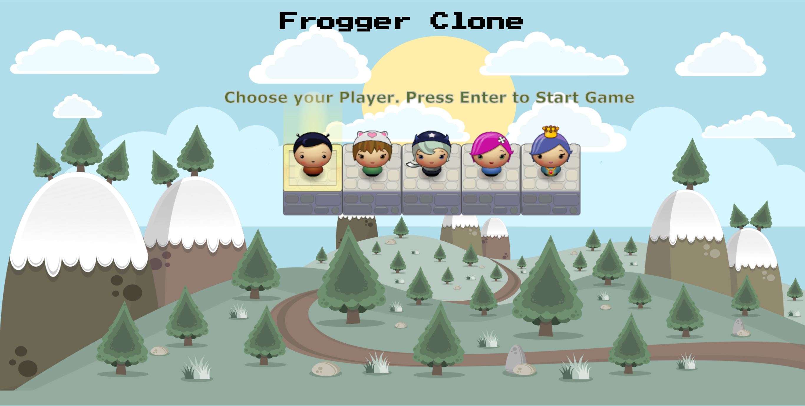

# Udacity Classic Arcade Game Clone

## Table of Contents

* [Project Purpose](#project-purpose)

## Project Purpose:

In this game you have a Player and Enemies (Bugs). The goal of the player is to reach the water, without colliding into any one of the enemies. The player can move left, right, up and down. The enemies move in varying speeds on the paved block portion of the scene. Once a the player collides with an enemy, the game is reset and the player moves back to the start square. Once the player reaches the water the game is won.

## How to Load the game

- Clone the [repo](https://github.com/sidneypp/arcade-game.git). and open index.html -- or --
- Play on GitHub.io: [Memory Game](https://sidneypp.github.io/arcade-game/)

### How to Play the Game

- Use the arrows to highlight which player you wish to use.
- Press Enter to choose your player and start the game.
- To play the game, use the arrow keys from your keyboard to move your player.
- Avoid touching bugs.
- If you touch a bug you lose a life, if you have no lives the game is over.

### Screenshots

 

## Resources used to create the game:

### Array shuffle:

- http://stackoverflow.com/a/2450976>

### Background Game Art By Alucard

- <https://opengameart.org/content/2d-backgrounds-set>

### Font Press Start P2

- <https://fonts.googleapis.com/css?family=Press+Start+2P>

#### Udacity Resources:

- [Project Rubric](https://review.udacity.com/#!/projects/2696458597/rubric)
- [Project Initial Code](https://github.com/udacity/frontend-nanodegree-arcade-game)
- [Project Instructions](https://docs.google.com/document/d/1v01aScPjSWCCWQLIpFqvg3-vXLH2e8_SZQKC8jNO0Dc/pub?embedded=true)
